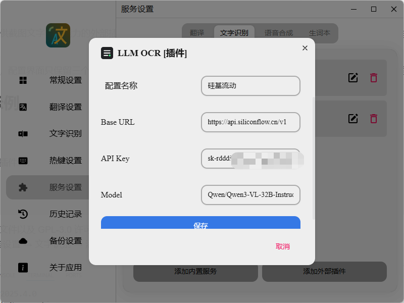
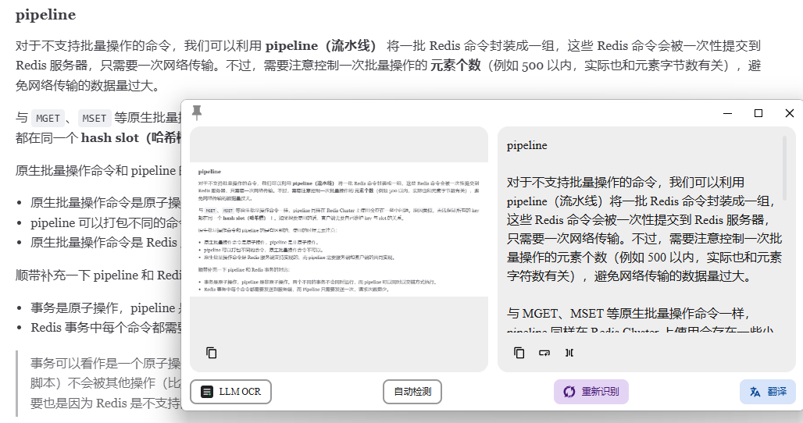
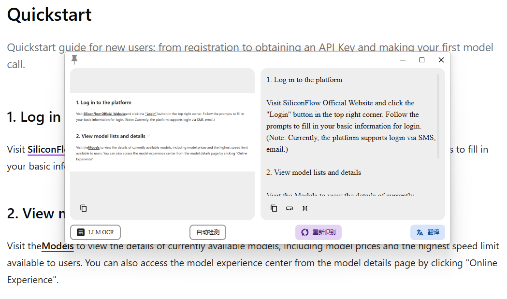

# Pot App LLM OCR 插件

## 介绍

这是一个为 [Pot App](https://github.com/pot-app/pot-desktop) 提供截图文字识别能力的外部插件。它将截图以图片输入发送至兼容 OpenAI `chat/completions` 协议的多模态模型，并将返回的纯文本交给 Pot 显示。

插件不绑定具体服务商，配置界面只保留三个字段：`Base URL`、`API Key` 和 `Model`。因此可以接入任意满足接口要求的视觉模型服务。

## 快速开始与示例

### 安装插件

可直接在releases下载插件， 也可自行编译：

1. 运行以下命令生成插件包：

   ```powershell
   npm test
   npm run build
   ```

   构建包会包含运行文件以及 GPL-3.0 许可证文件 `LICENSE`。

2. 在 Pot 中打开“服务设置 → 文字识别 → 添加外部插件”。
3. 选择 `dist/plugin.com.dean-op.llm_ocr.potext`。
4. 编辑 `LLM OCR` 服务，填写 API Key 和模型配置。

### SiliconFlow 示例

| 配置项 | 值 |
| --- | --- |
| Base URL | `https://api.siliconflow.cn/v1` |
| API Key | SiliconFlow API Key |
| Model | `Qwen/Qwen3-VL-32B-Instruct` |

完成配置后，将 `LLM OCR` 加入 Pot 的文字识别服务列表，使用截图 OCR 快捷键框选区域即可识别。

### 效果示例

参数配置界面：



中文识别效果：



英文识别效果：




## 接口要求

服务需要支持以下能力：

- `POST /v1/chat/completions`，或等效的完整 `/chat/completions` 地址；
- `Authorization: Bearer <API_KEY>` 身份验证；
- OpenAI 风格的 `image_url` 多模态消息内容；
- 非流式 JSON 响应，其中识别文本位于 `choices[0].message.content`。

模型必须具备图片理解能力。纯文本模型无法识别截图内容。

## 隐私说明

- 插件不内置、记录或提交 API Key。
- 截图会发送至你在 `Base URL` 中配置的第三方服务。
- 请在使用前确认该服务商的数据处理和隐私政策，避免上传账号凭据、身份证件、商业机密等敏感内容。
- API 调用可能产生模型费用，额度与计费规则由服务商决定。

## 开源协议

本项目以 [GNU General Public License v3.0](LICENSE) 发布。你可以在遵守该协议的前提下使用、修改和分发本项目。
